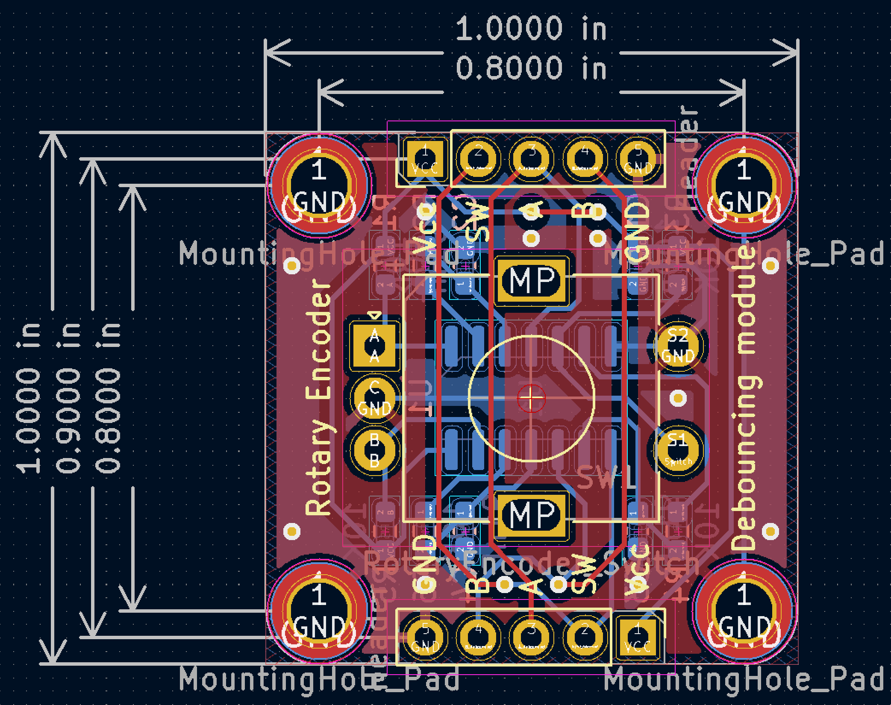
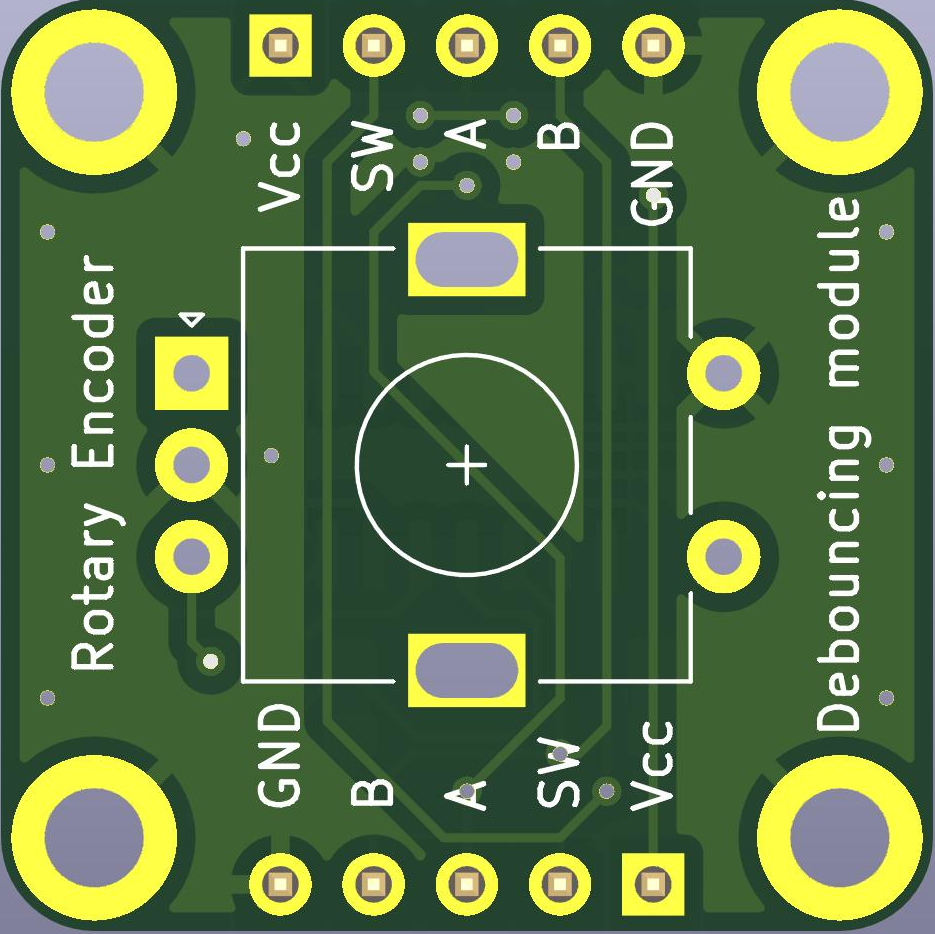
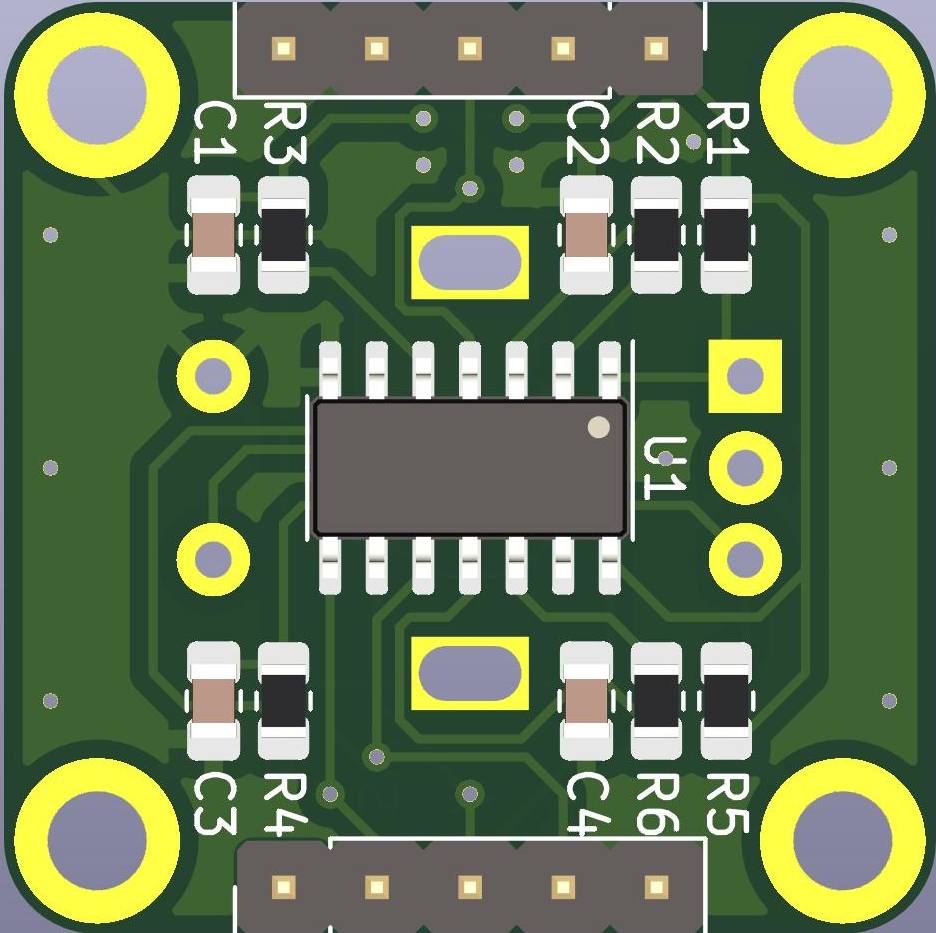

# Rotary Encoder module with Hardware Debouncing
 Module to debounce incremental rotary encoder with Schmitt trigger

 Current Status: Layout finished, need to solder and test the hardware

This module uses 74xx14 Schmitt inverting trigger to debounce incremental rotary encoder.

The schematic in this module uses 74xx14 connected as buffer/repeater, according to 74xx14 [datasheet (Rev. J)](datasheets/sn74hc14(rev.j).pdf) from Texas Instruments (Figure 5 in Chapter 9.2: Typical Application). Later revisions don't have this circuit specified in datasheet.

## Dimensions and layout

- Overall dimensions : 1 in × 1 in (25.4 mm × 25.4 mm)
- Headers spacing : 0.9in × 0.1 in (22.86 mm × 2.54 mm)
- Mounting holes spacing : 0.8in × 0.8 in (20.32 mm × 20.32 mm)

| Dimensions & layout | Top view | Bottom view |
| ------------- | ------------- | ------------- |
|   |   |   |

The PCB was developed in 2 options, both are located within `project_files` folder:
- `0603` : utilizes resistors and capacitors in 0603 package (metric equivalent: 1608)
- `0805` : utilizes resistors and capacitors in 0805 package (metric equivalent: 2012)

## Why was it made?
I wanted to have a module for EC11 rotary encoder with push-button with some requirements:
- contains a built-in debouncing circuitry (both encoder and button)
- has symmetrical location of pin headers
- includes a few mounting holes for M2.5 screws
- utilizes SMD components and their single-side location (except of the encoder itself)
- the center of module matches the center of encoder rotation axis
- usable with breadboards
- could be soldered manually
